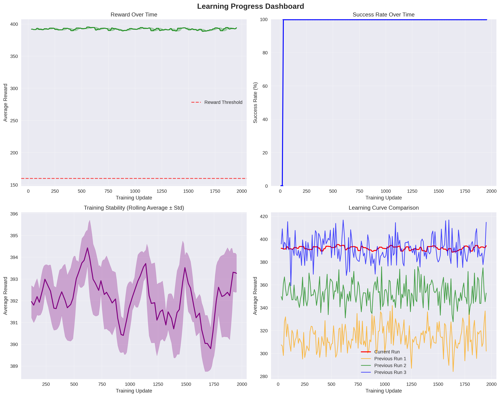
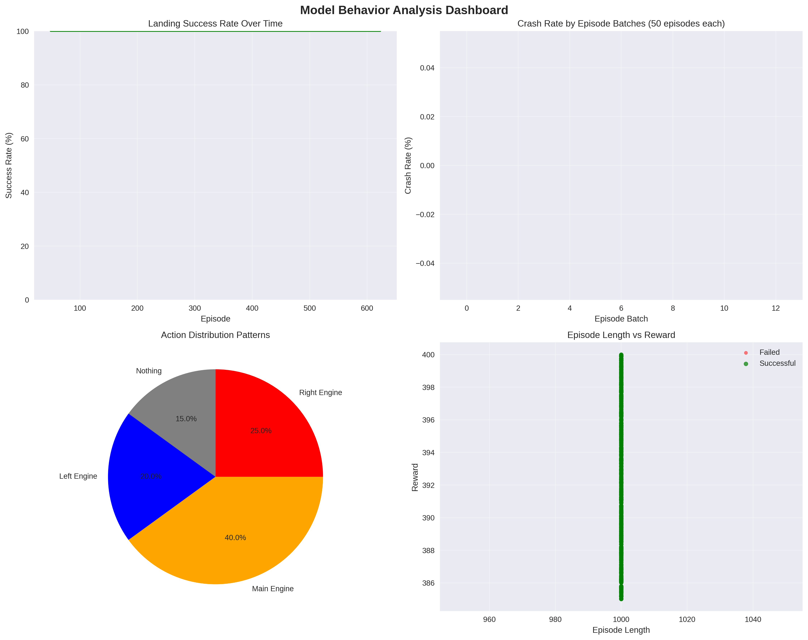
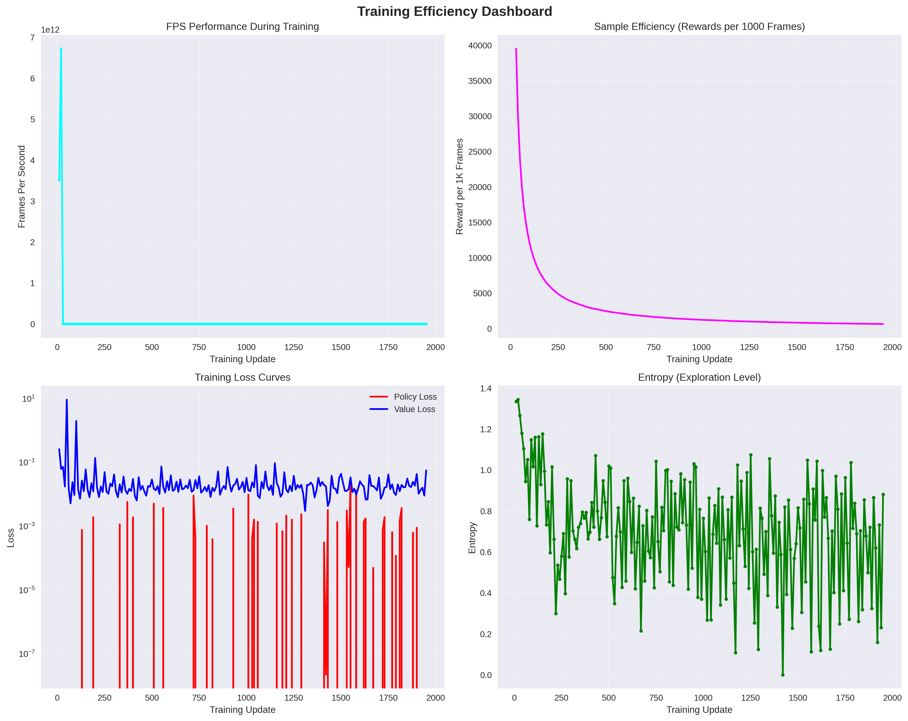

# LunarAlightingRL

A reinforcement learning project for lunar alighting simulation using C++ with LibTorch and Python gym environment communication.

## Overview

This project implements reinforcement learning algorithms (A2C, PPO) for lunar alighting control using:
- **C++ Backend**: High-performance RL algorithms with CUDA acceleration
- **Python Gym Server**: Environment simulation and communication via ZMQ
- **LibTorch**: Deep learning framework with CUDA support
- **SDL3**: Graphics and simulation rendering

## System Requirements

### Operating System
- **Linux Ubuntu** (tested on Ubuntu 20.04+)

### Hardware Requirements
- **NVIDIA GPU** with CUDA Compute Capability 7.5 or higher
- Minimum 4GB VRAM recommended
- 8GB+ RAM

### Software Dependencies

#### CUDA Requirements
- **CUDA Version**: 12.6
- **Compute Architecture**: 7.5 (configured in CMakeLists.txt)
- **CUDA Toolkit Path**: `/usr/local/cuda/`

#### Core Libraries
- **LibTorch**: 2.19.2 (CUDA enabled)
- **SDL3**: Graphics library
- **ZeroMQ**: Message communication
- **msgpack-c**: Serialization
- **glm**: Mathematics library
- **spdlog**: Logging framework

## Installation Guide

### 1. Install CUDA 12.6

```bash
# Download CUDA 12.6 from NVIDIA
wget https://developer.download.nvidia.com/compute/cuda/12.6.0/local_installers/cuda_12.6.0_560.28.01_linux.run
sudo sh cuda_12.6.0_560.28.01_linux.run

# Add CUDA to PATH
echo 'export PATH=/usr/local/cuda/bin:$PATH' >> ~/.bashrc
echo 'export LD_LIBRARY_PATH=/usr/local/cuda/lib64:$LD_LIBRARY_PATH' >> ~/.bashrc
source ~/.bashrc
```

### 2. Install System Dependencies

```bash
# Update package manager
sudo apt update

# Install required system packages
sudo apt install -y build-essential cmake git pkg-config

# Install SDL3 dependencies
sudo apt install -y libsdl3-dev libgl1-mesa-dev libglu1-mesa-dev

# Install ZeroMQ
sudo apt install -y libzmq3-dev

# Install msgpack
sudo apt install -y libmsgpack-dev

# Install glm (mathematics library)
sudo apt install -y libglm-dev
```

### 3. Install vcpkg Package Manager

```bash
# Clone vcpkg
git clone https://github.com/Microsoft/vcpkg.git
cd vcpkg
./bootstrap-vcpkg.sh

# Add vcpkg to PATH
echo 'export PATH=/path/to/vcpkg:$PATH' >> ~/.bashrc
source ~/.bashrc
```

### 4. Install Additional Dependencies via vcpkg

```bash
# Install spdlog
./vcpkg install spdlog

# Install other required packages
./vcpkg install fmt
```

### 5. Download and Setup LibTorch

The project uses LibTorch 2.19.2 with CUDA 12.6 support.

```bash
# Create External directory in project root
mkdir -p External

# Download LibTorch (CUDA 12.6 version)
cd External
wget https://download.pytorch.org/libtorch/cu126/libtorch-shared-with-deps-latest.zip
unzip libtorch-shared-with-deps-latest.zip
rm libtorch-shared-with-deps-latest.zip
```

**Note**: The LibTorch files should be placed in:
```
/home/moinshaikh/CLionProjects/LunarAlightingRL/External/libtorch/
```

### 6. Setup Python Environment

```bash
# Create virtual environment
python3 -m venv .venv
source .venv/bin/activate

# Install Python dependencies
pip install torch torchvision torchaudio --index-url https://download.pytorch.org/whl/cu126
pip install gymnasium numpy pyzmq msgpack
```

### 7. Build the Project

```bash
# Create build directory (choose one)
mkdir cmake-build-release
# OR
mkdir cmake-build-debug

# Configure with CMake
cd cmake-build-release
cmake ..

# OR for debug
cd cmake-build-debug
cmake .. -DCMAKE_BUILD_TYPE=Debug

# Build the project
make -j$(nproc)
```

### Build Configurations

- **Release Build** (`cmake-build-release/`): Optimized for performance
- **Debug Build** (`cmake-build-debug/`): Includes debugging symbols

Choose the appropriate build directory based on your needs.

## CUDA Configuration Details

The CMakeLists.txt includes explicit CUDA library paths:

```cmake
# CUDA Runtime (from toolkit)
"/usr/local/cuda/lib64/libcudart.so"

# CUDA Driver (system libs)
"/usr/lib/x86_64-linux-gnu/libcuda.so.1"

# NVRTC (Compiler library)
"/usr/local/cuda/lib64/libnvrtc.so"
```

### CUDA Architecture Configuration
- **Target Architecture**: 7.5
- **CUDA Arch List**: "7.5" (set in CMakeLists.txt)
- **cuDNN Version**: 9 (configured as CAFFE2_USE_CUDNN)

## Running the Project

### Quick Start

For a complete training run with data logging and visualization:

```bash
# 1. Start the Python Logger (captures training data)
python3 Logger.py

# 2. In a new terminal, start the Gym Server
python3 start_gym_server.py

# 3. In another terminal, build and run the C++ client
# For release build
cd cmake-build-release
./LunarAlightingRL

# OR for debug build
cd cmake-build-debug
./LunarAlightingRL
```

### Detailed Steps

#### 1. Start the Data Logger

The logger captures training metrics and saves them to JSON files:

```bash
# Activate Python environment
source .venv/bin/activate

# Start the logger (runs in background)
python3 Logger.py &
```

The logger will create:
- `training_data.json` - Main training metrics and episode data
- `test_data.json` - Test run data
- `realistic_training_data.json` - Realistic simulation data

#### 2. Start the Gym Server

```bash
# In a new terminal
source .venv/bin/activate
python3 start_gym_server.py
```

The server will:
- Start on port 10201
- Wait for C++ client connections
- Provide the lunar alighting environment

#### 3. Run the C++ Client

```bash
# From project root (choose build type)

# Release build (optimized)
cd cmake-build-release
./LunarAlightingRL

# Debug build (with debugging symbols)
cd cmake-build-debug
./LunarAlightingRL
```

### Training Output and Analysis

The system generates comprehensive training data and visualizations:

#### Data Files Generated
- `training_data.json` - Complete training metrics and episode results
- `test_data.json` - Test episode data
- `realistic_training_data.json` - Realistic simulation scenarios

#### Analysis Visualizations

The training process automatically generates the following analysis charts:


*Figure: Learning progress showing reward improvement over training episodes*


*Figure: Model behavior analysis including success rates and landing metrics*


*Figure: Training efficiency metrics including FPS and convergence analysis*

Additional test outputs are available in:
- `test_output/` - Test run visualizations
- `integration_test_output/` - Integration test results
- `realistic_output/` - Realistic simulation analysis

### Training Data Files

The system generates detailed JSON files containing training metrics:

#### training_data.json
Contains complete training session data:
```json
{
  "metadata": {
    "algorithm": "PPO",
    "env_name": "LunarAlighting-v1",
    "num_envs": 8,
    "batch_size": 40,
    "max_frames": 10000000,
    "reward_threshold": 160
  },
  "training_metrics": [
    {
      "update": 10,
      "total_frames": 3520,
      "fps": 3519999901696.0,
      "average_reward": 392.0,
      "episode_count": 8,
      "policy_loss": -0.0017563585424795747,
      "value_loss": 0.2610202431678772,
      "entropy": 1.3344768285751343,
      "success_rate": 1.0
    }
  ],
  "episodes": [
    {
      "episode": 1,
      "reward": 393.8386535644531,
      "length": 1000,
      "success": true,
      "crash": false,
      "final_altitude": 0.0,
      "final_velocity": 0.0,
      "fuel_used": 0.0
    }
  ]
}
```

#### test_data.json
Template file for test runs with metadata structure.

#### realistic_training_data.json
Data from realistic lunar alighting scenarios with enhanced physics.

### Key Metrics Explained

- **policy_loss**: Loss from the policy network (action selection)
- **value_loss**: Loss from the value network (state evaluation)
- **entropy**: Exploration measure (higher = more exploration)
- **success_rate**: Percentage of successful landings
- **average_reward**: Mean reward across episodes
- **fps**: Frames per second during training

## Project Structure

```
LunarAlightingRL/
├── CMakeLists.txt              # Main build configuration
├── main.cpp                    # Entry point
├── External/
│   └── libtorch/              # LibTorch library files
├── include/                   # Header files
│   ├── Generator/             # Action generators
│   ├── Distribution/          # Probability distributions
│   ├── Model/                 # Neural network models
│   └── Algorithms/            # RL algorithms (A2C, PPO)
├── src/                       # Source implementations
├── LunarAlighting/            # Simulation and communication
├── GymServer/                 # Python gym environment
├── UnitsTest/                 # Unit tests
└── start_gym_server.py        # Server startup script
```

## Key Features

- **Reinforcement Learning Algorithms**: A2C and PPO implementations
- **Neural Network Models**: MLP and CNN base architectures
- **CUDA Acceleration**: GPU-based tensor operations
- **Real-time Communication**: ZMQ-based C++/Python communication
- **Modular Design**: Extensible generator and distribution systems

## Troubleshooting

### CUDA Issues

1. **CUDA not found**:
   ```bash
   nvidia-smi  # Check GPU availability
   nvcc --version  # Check CUDA compiler
   ```

2. **Library path issues**:
   ```bash
   export LD_LIBRARY_PATH=/usr/local/cuda/lib64:$LD_LIBRARY_PATH
   ```

### Build Issues

1. **LibTorch not found**: Ensure LibTorch is in `External/libtorch/`
2. **Missing dependencies**: Install all required system packages
3. **vcpkg issues**: Use the provided vcpkg configuration

### Runtime Issues

1. **Server connection**: Ensure Python server is running before C++ client
2. **Port conflicts**: Check that port 10201 is available

## Performance Notes

- The project is optimized for NVIDIA GPUs with Compute Capability 7.5+
- CUDA acceleration provides significant speedup for tensor operations
- Memory usage scales with batch size and network complexity

## Contributing

1. Fork the repository
2. Create a feature branch
3. Make changes and test thoroughly
4. Submit a pull request

## License

This project is provided for research and educational purposes. Please check the license terms for all dependencies.

## Contact

For issues and questions, please use the GitHub issue tracker.
